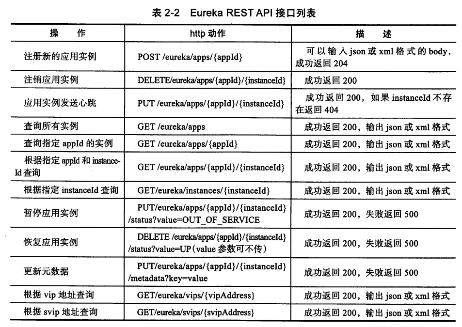
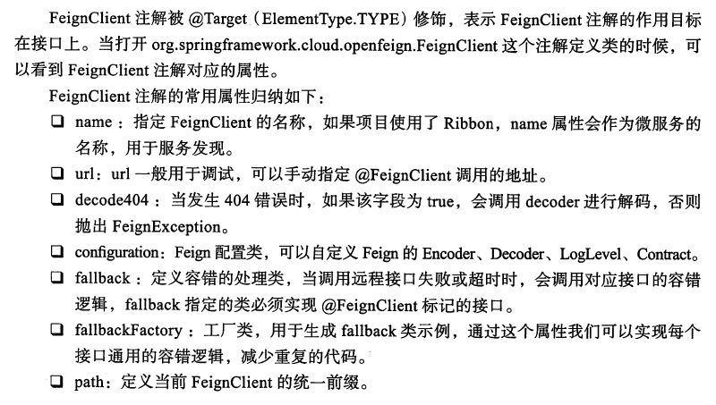
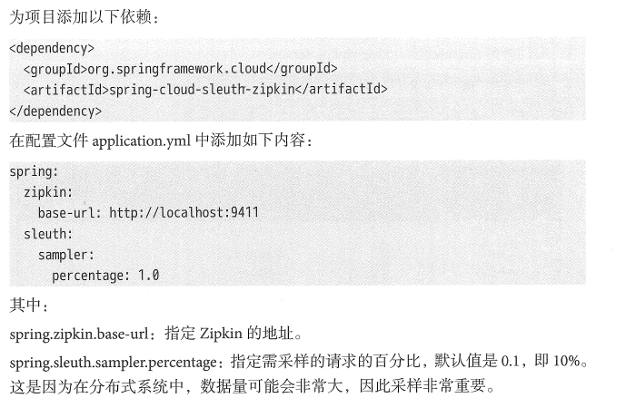
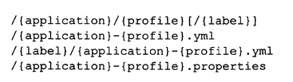
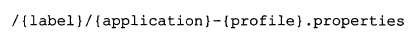

# SpringCloud教程

## 1.Eureka

### 1.1 Client端

1. 
2. 
3. 

### 1.2 Server端

1. 
2. 
3. 

### 1.3 Rest API



## 2.Zuul

1. 简介

   1. 基于JVM路由和服务端的负载均衡器
   2. zuul的核心是过滤器
      1. 动态路由
      2. 请求监控
      3. 认证授权
      4. 压力测试
      5. 灰度发布
   3. 过滤器类型
      1. pre:请求前被调用
      2. route:请求时被调用，适用灰度发布场景
      3. post:在route和error之后被调用，将请求路由到达具体的服务之后执行。适用于需要添加响应头，记录响应日志等场景
      4. error:处理请求时发生错误时被调用。在执行过程中发送错误时会进入error过滤器。
      5. 

2. 典型配置

   1. 单实例

      ```yml
      zuul:
      	routes:
      		client-a:
      			path: /client/**
      			servicedId: client-a
      		client-a: /client/**
      		client-a: #默认的映射规则/client-a/**,相当于第一种方式
      ```

   2. 单实例url映射

      ```yml
      zuul:
      	routes:
      		client-a:
      			path: /client/**
      			url: http://localhost:7070
      ```

   3. 多实例路由

      1. 使用Eureka中继承的基本负载均衡功能，如果要使用Ribbon，需要指定一个serviceId，此操作需要禁止Ribbon使用eureka

      ```yml
      zuul:
      	routes:
      		client-a:
      			path: /client/**
      			servicedId: client-a
      ribbon:
      	eureka:
      		enable: false #禁止ribbon使用eureka
      ribbon-route:
      	ribbon:
      		xx:xxx
      ```

   4. forward本地跳转

      ```java
      @GetMapping("/client") // 跳转到该方法上
      public String add(Integer a,Integer b){
          return "本地跳转:"+(a+b);
      }
      ```

      ```yml
      zuul:
      	routes:
      		client-a:
      			path: /client/**
      			url: forward:/client
      ```

   5. 相同路径的加载规则

      ```yml
      zuul:
      	routes:
      		client-a:
      			path: /client/**
      			url: forward:/client-a
      		client-b: # 总是加载最末的服务
      			path: /client/**
      			url: forward:/client-b
      ```

   6. 路由通配符

      ```
      /**
      /*
      /?
      ```

      

3. 功能配置

   1. 路由前缀：

      ```yml
      zuul:
      	prefix: /pre
      	routes:
      		client-a:
      			path: /client/**
      			url: forward:/client-a
      			stripPrefix: false # 关闭路由前缀
      ```

   2. 服务屏蔽与路径屏蔽

      ```yml
      zuul:
      	prefix: /pre
      	ignored-services: client-b #忽略的服务，防服务侵入
      	ignored-patterns: /**/div/** #忽略的接口，屏蔽接口
      	routes:
      		client-a:
      			path: /client/**
      			url: forward:/client-a
      ```

   3. 敏感头信息

      ```yml
      zuul:
      	prefix: /pre
      	routes:
      		client-a:
      			path: /client/**
      			url: forward:/client-a
      			sensitiveHeaders: Cookie,Set-Cookie,Authorization
      ```

   4. 重定向问题

      ```yml
      zuul:
      	add-host-header: true #host为zuul的host
      ```

   5. 重试机制(默认继承Ribbon)

      ```yml
      zuul:
      	retryable: true #开启重试
      ribbon:
      	MaxAutoRetries: 1 # 同一个服务重试的次数(除去首次)
      	MaxAutoRetriesNextServer: 1 # 切换相同服务数量
      	ConnectTimeout: 250 # 连接超时时间(ms)
        	ReadTimeout: 2000 # 通信超时时间(ms)
        	OkToRetryOnAllOperations: true # 是否对所有操作重试
       spring:
       	cloud:
       		loadblancer:
       			retry:
       				enable: true #内部默认已开启，这里列出来说明这个参数比较重要
      ```

4. 容错机制

   1. 

5. 回退机制

   1. zuul默认整合了 Hystrix
   2. 实现ZuulFallbackProvider接口

6. 高可用

   1. 

7. zuul+OAuth2.0+JWT

   1. OAuth2.0面向资源授权协议
   2. 
   3. 
   4. @EnableOAuth2Sso

8. zuul限流

   1. 限流算法
      1. 漏桶(Leaky Bucket)
      2. 令牌桶(Token Bucket)

9. 动态路由

   1. 

10. 灰度发布

    1. 系统迭代新功能时的一种平滑过渡的上线方式。
    2. 在原有系统的基础上，额外增加一个新版本，这个新版本包含我们需要待验证的新功能，随后用负载均衡器引入一小部分流量到这个新版本应用，如果整个过程没有出现任何差错，在平滑地把线上系统或服务一步步替换成新版本，至此完成一次灰度发布。

11. 饥饿加载

    1. 默认使用Ribbon来调用远程服务，所以由于Ribbon的原因，第一次经过Zuul的调用往往会去注册中心读取服务注册表，初始化Ribbon负载信息，这是一种懒加载策略。

       ```yml
       zuul: # 开启饥饿加载
       	ribbon:
       		eager-load:
       			enable: true
       ```

12. 请求体修改

    1. 
    2. 

13. 使用okhttp替换HttpClient

    1. <dependency>

       ```yml
       ribbon:
       	httpclient:
       		enable: false
       	okhttp:
       		enable: true
       ```

14. Header传递

    1. Zuul中对请求做了一些处理，需要把处理结果发给下游服务，但是又不能影响请求体的原始特性

       ```java
       RequestContext context = RequestContext.getCurrentContext();
       context.addZuulRequestHeader("result","to next service")
       ```

15. Swagger2整合

    1. ```java
       @Configuration
       @EnableSwagger2
       public class SwaggerConfig {
           @Autowired
           ZuulProperties zuulProperties;
       
           @Primary
           @Bean
           public SwaggerResourcesProvider swaggerResourcesProvider() {
               return () -> {
                   List<SwaggerResource> resources = new ArrayList<>();
                   zuulProperties.getRoutes().values().stream()
                           .forEach(route -> resources
                                   .add(createResource(route.getServiceId(), route.getServiceId(), "2.0")));
                   return resources;
               };
           }
       
           private SwaggerResource createResource(String name, String location, String version) {
               SwaggerResource swaggerResource = new SwaggerResource();
               swaggerResource.setName(name);
               swaggerResource.setLocation("/" + location + "/v2/api-docs");
               swaggerResource.setSwaggerVersion(version);
               return swaggerResource;
           }
       }
       ```

### 2.1 多层负载

1. 
2. 
3. 

### 2.2 应用优化

1. 容器优化:内置容器Tomcat与Undertow的比较与参数设置
2. 组件优化:内部集成的组件优化，如Hystrix线程隔离、Ribbon
3. JVM参数优化:适用于网关应用的JVM参数建议
4. 内部优化:

## 3.Gateway

1. 简介
   1. 提供简单、有效且统一的API路由管理方式
   2. 路由:路由是网关最基础的部分
   3. 断言:java8中的断言函数。
   4. 过滤器:一个标准的Spring webFilter。springcloudgateway中的filter分为两种Gateway Filter和Global Filter
2. 工作流程图
   1. 

### 3.1 路由断言

1. After路由断言工厂

   1. 

   2. ```yml
      spring:
        cloud:
          gateway:
            routes:
              - id: jd_route
                uri: http://jd.com:80/
                predicates:
                  - Path=/jd
                  - After=2019-07-21T22:30:15.854+08:00[Asia/Shanghai]
      ```

2. Before路由断言工厂

   1. 

   2. ```yml
      spring:
        cloud:
          gateway:
            routes:
              - id: jd_route
                uri: http://jd.com:80/
                predicates:
                  - Before=2022-03-13T00:54:30.877+08:00[Asia/Shanghai]
      ```

3. Between路由断言工厂

   1. 

   2. ```yml
      spring:
        cloud:
          gateway:
            routes:
              - id: jd_route
                uri: http://jd.com:80/
      		  predicates:
                - name: Between
                    args:
                        datetime1: 2019-07-21T22:30:15.854+08:00[Asia/Shanghai]
                        datetim2: 2019-08-21T22:30:15.854+08:00[Asia/Shanghai]
      ```

4. Cokkie路由断言工厂

   1. 

   2. ```yml
      spring:
        cloud:
          gateway:
            routes:
              - id: jd_route
                uri: http://jd.com:80/
                predicates:
                  - Cookie=chocolate, ch.p
      ```

5. Header路由断言工厂

   1. 
   2. 

6. Host路由断言工厂

   1. 
   2. 

7. method路由断言工厂

   1. 

8. Query路由断言工厂

   1. 
   2. 

9. RemoteAddr路由断言工厂

   1. 

### 3.2 Gateway的内置Filter

1. addRequestHeader过滤器工厂
   1. 使用java流式API配置路由的配置
   2. 
2. addRequestParameter过滤器
   1. 对匹配上的请求路由添加请求参数
   2. 
3. RewritePath过滤器
   1. 
   2. 
4. AddResponseHeader过滤器
   1. 
5. StripPrefix过滤器
   1. 
6. Retry过滤器
   1. 
7. Hystrix过滤器
   1. 

### 3.3 权重路由

1. ```yml
   spring:
     application:
       name: sc-gateway-server
     cloud:
       gateway:
         routes:
         - id: service1_v1
           uri: http://localhost:8081/v1
           predicates:
             - Path=/test
             - Weight=service1, 95
         - id: service1_v2
           uri: http://localhost:8081/v2
           predicates:
             - Path=/test
             - Weight=service1, 5
   ```

2. Https使用技巧

   1. ```yml
      server:
      ssl:
        key-alias: spring
        enabled: true
        key-password: spring
        key-store: classpath:selfsigned.jks
        key-store-type: JKS
        key-store-provider: SUN
        key-store-passowrd: spring
      ```

3. 集成Swagger

   ```
   
   ```

### 3.4 限流

1. 概述
   1. 高并发系统三把利器保护系统：缓存、降级和限流
   2. 缓存：提升系统访问速度和增大系统处理的容量
   3. 降级：当服务出现问题或影响到核心流程时，需要暂时将其屏蔽掉
   4. 限流：秒杀、抢购、写服务(如评论、下单)频繁的复杂查询,通过对并发访问/请求进行限速或者对一个时间窗口内的请求进行限速来保护系统，一旦达到限制速率可以拒绝服务、排队或等待、降级
   5. 两种限流模式：控制速率和控制并发
2. 自定义过滤器实现限流
   1. 
3. 内置过滤器工厂限流
   1. 
4. 基于CPU的使用率进行限流
   1. 
5. 动态路由

## 4.Ribbon

1. 定义

   1. 集中式负载均衡
   2. 进程式负载均衡:从实例库选取一个实例进行流量导入，客户端负载均衡
   3. 

2. 负载均衡策略

   1. 

   2. 

   3. 饥饿加载

      1. ```yml
         ribbon:  
         	eager-load:    
         	enabled: true    
         	clients: client-a
         ```

   4. 利用配置文件自定义Ribbon

      1. 

### 4.1 核心工作原理

1. 

## 5.Hystrix

1. 定义
   1. 
   2. 通过客户端库对延迟和故障进行保护和控制
   3. 在一个复杂的分布式系统中停止级联故障
   4. 快速失败和迅速恢复
   5. 在合理的情况下回退和优雅地降级
   6. 开启近实时监控、告警和操作控制
2. 
3. 
4. 

### 5.1 Hystrix配置说明

1. 
2. 

### 5.2 Hystrix线程调整和计算

1. 

### 5.3 请求缓存

1. 
2. 
3. 使用类开启缓存
   1. 
4. 使用注解开启缓存
   1. 
5. 使用注解清除缓存
   1. 
6. 

### 5.4 Hystrix Request Collapser


1. 使用注解进行请求合并
   1. 
   2. 
   3. 
   4. 
   5. 
   6. 
2. Hystrix线程传递及并发策略
   1. 
   2. 

### 5.5 Hystrix命令注解

1. 
2. 
3. 
4. 
5. 

### 5.6 Turbine 聚合监控数据

1. 简介

   1. 是一个聚合Hystrix监控数据的工具，它可将所有相关hystrix.stream端点的数据聚合到一个组合的/turbine.stream中，而让集群的监控更加方便

2. ```yml
   turbine:
     aggregator:
       cluster-config: default
     app-config: seckill-service
     cluster-name-expression: new String("default")
   ```

   

## 6.Feign

1. 简介

   1. 声明式的Web Service客户端
   2. 声明式、模板化的HTTP客户端
   3. 可插拔的注解主持，包括Feign注解和JAX-RS注解
   4. 支持可插拔的HTTP编码器和解码器
   5. 支持Hystrix和它的Fallback
   6. 支持Ribbon的负载均衡
   7. 支持HTTP请求和响应的压缩,整合了Ribbon和Hystrix

2. 注解剖析

   1. 

3. 开启GZIP压缩

   1. ```yml
      feign:
      	compression:
      		request:
      			enable: true
      		mime-types: text/xml.application/xml,application/json #配置压缩支持的MIME TYPE
      		min-request-size: 2048 #配置压缩数据大小的下限
      		response:
      			enable: true # 配置响应GZIP压缩
      ```

      

4. 属性文件配置

   1. 
   2. 

5. 开启日志

   1. 

6. 超时设置

   1. Feign的调用分两层，即Ribbono的调用和Hystrix的调用，高版本的Hystrix默认是关闭的
   2. 

### 6.1 Feign默认Client的替换

1. 默认使用URLConnection发送HTTP请求，没有连接池，但是对每一个地址会保持长连接
2. 使用httpClient替换
   1. 导入
   2. 
3. 使用okhttp替换
   1. 
   2. 
   3. 

### 6.2 Feign的Post和Get的多参数传递

1. 

### 6.3 文件上传

1. 

### 6.4 首次请求失败问题

1. 

### 6.5 返回图片流处理方式

1. 

### 6.5 Feign调用传递Toekn

1. 
2. 

### 6.6 venus-cloud-feign 设计与使用

1. 

## 7. 分布式事务解决方案

### 7.1 2PC

1. 两阶段提交(two-phase Commit):分布式事务解决数据的一致性问题，引入一个作为协调者的组件来统一掌控所有节点的操作结果并最终指示这些节点是否要把操作结果进行真正的提交.参与者将操作成功通知协调者，再由协调者根据所有参与者的反馈情报决定各参与者是要提交还是中止操作

### 7.2 TCC补偿性

1. Try、Confirm、Cancel：Try预留业务资源，Confirm确认执行业务操作、Cancel取消执行业务操作
2. 首先通过Try锁住服务中的业务资源进行资源预留，只有资源预留成功了，后续操作才能正常进行，Cancel进行回滚

### 7.3 最终一致性

### 7.4 最大努力通知型事务

1. 尽自己最大的努力通知对方，但是不保证一定能通知到

## 8. 分布式任务调度

1. Elastic-Job

### 8.1 概念

1. 分片概念

   1. 任务的分布式执行，需要将一个任务拆分为多个独立的任务项，然后由分布式的服务器分别执行某一个或几个分片项。

      例如：有一个遍历数据库某张表的作业，现有2台服务器。为了快速的执行作业，那么每台服务器应执行作业的50%。 为满足此需求，可将作业分成2片，每台服务器执行1片。作业遍历数据的逻辑应为：服务器A遍历ID以奇数结尾的数据；服务器B遍历ID以偶数结尾的数据。 如果分成10片，则作业遍历数据的逻辑应为：每片分到的分片项应为ID%10，而服务器A被分配到分片项0,1,2,3,4；服务器B被分配到分片项5,6,7,8,9，直接的结果就是服务器A遍历ID以0-4结尾的数据；服务器B遍历ID以5-9结尾的数据。

2. 核心理念

   1. 分布式调度

      1. Elastic-Job-Lite并无作业调度中心节点，而是基于部署作业框架的程序在到达相应时间点时各自触发调度。

         注册中心仅用于作业注册和监控信息存储。而主作业节点仅用于处理分片和清理等功能。

   2. 作业高可用

      1. Elastic-Job-Lite提供最安全的方式执行作业。将分片总数设置为1，并使用多于1台的服务器执行作业，作业将会以1主n从的方式执行。

         一旦执行作业的服务器崩溃，等待执行的服务器将会在下次作业启动时替补执行。开启失效转移功能效果更好，可以保证在本次作业执行时崩溃，备机立即启动替补执行。

   3. 最大限度利用资源

      1. Elastic-Job-Lite也提供最灵活的方式，最大限度的提高执行作业的吞吐量。将分片项设置为大于服务器的数量，最好是大于服务器倍数的数量，作业将会合理的利用分布式资源，动态的分配分片项。

         例如：3台服务器，分成10片，则分片项分配结果为服务器A=0,1,2;服务器B=3,4,5;服务器C=6,7,8,9。 如果服务器C崩溃，则分片项分配结果为服务器A=0,1,2,3,4;服务器B=5,6,7,8,9。在不丢失分片项的情况下，最大限度的利用现有资源提高吞吐量。

3. 架构图

### 8.2 作业开发

1. Simple(简单任务)
2. Dataflow(数据流任务)
3. Script()

### 8.3 配置文件

1. 
2. 作业配置
   1. 
   2. 
3. dataflow 独有配置
   1. 拥有job:simple所有的空间属性属性
4. script独有配置
   1. 拥有job:simple所有的空间属性属性
   2. 

### 8.4 多节点并行调度

1. 分片概念

   1. 将一个任务拆分为多个独立的任务项，然后由分布式的服务器来分别执行某一个或几个分片项

2. 任务节点分片策略

   1. AverageAllocati onJobShardingStrategy
      全路径：
      com.dangdang.ddframe.job.lite.api.strategy.impl.AverageAllocationJobShardingStrategy
      策略说明： 基于平均分配算法的分片策略，也是默认的分片策略。
      如果分片不能整除，则不能整除的多余分片将依次追加到序号小的服务器。如：
      如果有3 台服务器，分成9 片， 则每台服务器分到的分片是： 1= [0,1,2] , 2=[3,4,5] ,3=[6,7,8]
      如果有3 台服务器，分成8 片，则每台服务器分到的分片是： 1 =[0,1,2],2=[2,3,7],3=[4,5]
      如果有3 台服务器，分成10 片，则每台服务器分到的分片是： 1=[0,1,2 , 9], 2=[3,4,5],3=[6,7,8]

   2. OdevitySortByName Jo bShardingStrategy
      全路径：
      com.dangdang.ddframe.job.lite.api.strategy. impl.OdevitySortByNameJobShardingStrategy
      策略说明：根据作业名的Hash 值奇偶数决定IP 升降序算法的分片策略。

      作业名的Hash值为奇数则IP 升序
      作业名的Hash值为偶数则IP 降序
      用于不同的作业平均分配负载至不同的服务器。
      AverageAllocationJobShardingStrategy 的缺点是，一旦分片数小于作业服务器数， 作业将永远分配至IP 地址靠前的服务器，导致IP 地址靠后的服务器空闲。OdevitySortByName
      JobShardingstrategy 则可以根据作业名称重新分配服务器负载。如：
      如果有3 台服务器，分成2 片，作业名称的Hash 值为奇数，则每台服务器分到的分
      片是： 1 =[0], 2＝［1]， 3=[]
      如果有3 台服务器，分成2 片，作业名称的Hash 值为偶数， 则每台服务器分到的分
      片是： 3=[0],2＝[1],1 =[]

   3. RotateServerByNameJobShardingStrategy
      全路径：
      com.dangdang.ddframe.job.lite.api.strategy.impl.RotateServerByNameJobShardingStrategy
      策略说明：根据作业名的Hash 值对服务器列表进行轮转的分片策略。

3. 业务数据分片处理

   1. ```
      sharding-total-count="2" sharding-item-parameters="0=0,1=1"
      ```

4. 事件追踪

5. 自定义监听器

   1. 

## 9. 分布分表解决方案

### 9.1 功能列表

1. 分库分表
   1. SQL 解析功能完善，支持聚合、分组、排序、LIMIT 、TOP 等查询，并且支持级联表以及笛卡儿积的表查询
   2. 支持内、外连接查询
   3. 分片策略灵活， 可支持等号、BETWEEN 、IN 等多维度分片， 也可支持多分片键共用，以及自定义分片策略
   4. 基于Hint 的强制分库分表路由
2. 读写分离
   1. 一主多从的读写分离配置，可配合分库分表使用
   2. 基于Hint 的强制主库路由
3. 柔性事务
   1. 最大努力送达型事务
   2. TCC 型事务（TBD)
4. 分布式主键
   1. 统一的分布式基于时间序列的ID 生成器
5. 兼容性
   1. 可适用于任何基于Java 的ORM 框架，如： JPA 、Hibernate 、Mybatis 、Spring JDBCTemplate，或者直接使用JDBC
   2. 可基于任何第三方的数据库连接池如： DBCP, C3PO 、BoneCP , Druid 等
   3. 理论上可支持任意实现JDBC 规范的数据库。目前支持MySQL 、Oracle 、SQLServer和PostgreSQL
6. 灵活多样的配置
   1. Java
   2. Spring 命名空间
   3. YAML
   4. Inline 表达式

### 9.2 概念

1. Logic Table
   1. 数据分片的逻辑表，对于水平拆分的数据库（表），同一类表的总称。例： 订单数据根据主键尾数拆分为10 张表分别是t _order_0 到t_order_9，它们的逻辑表名为t order 。
2. ActualTable
   1. 在分片的数据库中真实存在的物理表。即上个概念中的t _order_0 到t_order_9。
3. Data Node
   1. 数据分片的最小单元。由数据源名称和数据表组成，例： ds_1.t order_0。配置时默认各个分片数据库的表结构均相同，直接配置逻辑表和真实表对应关系即可。如果各数据库
      的表结果不同，可使用ds.actual_table 配置。
4. Dynamic Table
   1. 逻辑表和真实表不一定需要在配置规则中静态配置。比如按照日期分片的场景，真实表的名称随着时间的推移会产生变化。此类需求Sharding-JDBC 是支持的，不过目前配置并不友好，会在新版本中提升。
5. BindingTable
   1. 指在任何场景下分片规则均一致的主表和子表。例：订单表和订单项表，均按照订单ID 分片，则此两张表互为BindingTable 关系。BindingTable 关系的多表关联查询不会出现笛卡儿积关联，关联查询效率将大大提升。
6. ShardingColumn
   1. 分片字段。用于将数据库（表）水平拆分的关键字段。例：订单表订单ID 分片尾数取模分片， 则订单ID 为分片字段。SQL 中如果无分片字段，将执行全路由，性能较差Sharding-JDBC 支持多分片字段。
7. ShardingAlgorithm
   1. 分片算法。Sharding-JDBC 通过分片算法将数据分片，支持通过等号、BETWEEN和IN 分片。分片算法目前需要业务方开发者自行实现，可实现的灵活度非常高。未来Sharding-JDBC 也将会实现常用分片算法，如range 、hash 和tag 等。
8. SQL Hint
   1. 对于分片字段非SQL 决定，而由其他外置条件决定的场景，可使用SQL Hint 灵活注入分片字段。例：内部系统，按照员工登录ID 分库，而数据库中并无此字段。SQL Hint 支持通过ThreadLocal 和SQL 注释（待实现）两种方式使用。

### 9.3 配置文件

1. ```yml
   sharding.jdbc.datasource.names= #数据源名称，多数据源以逗号分隔
    
   sharding.jdbc.datasource.<data-source-name>.type= #数据库连接池类名称
   sharding.jdbc.datasource.<data-source-name>.driver-class-name= #数据库驱动类名
   sharding.jdbc.datasource.<data-source-name>.url= #数据库url连接
   sharding.jdbc.datasource.<data-source-name>.username= #数据库用户名
   sharding.jdbc.datasource.<data-source-name>.password= #数据库密码
   sharding.jdbc.datasource.<data-source-name>.xxx= #数据库连接池的其它属性
    
   sharding.jdbc.config.sharding.tables.<logic-table-name>.actual-data-nodes= #由数据源名 + 表名组成，以小数点分隔。多个表以逗号分隔，支持inline表达式。缺省表示使用已知数据源与逻辑表名称生成数据节点。用于广播表（即每个库中都需要一个同样的表用于关联查询，多为字典表）或只分库不分表且所有库的表结构完全一致的情况
    
   #分库策略，缺省表示使用默认分库策略，以下的分片策略只能选其一
    
   #用于单分片键的标准分片场景
   sharding.jdbc.config.sharding.tables.<logic-table-name>.database-strategy.standard.sharding-column= #分片列名称
   sharding.jdbc.config.sharding.tables.<logic-table-name>.database-strategy.standard.precise-algorithm-class-name= #精确分片算法类名称，用于=和IN。该类需实现PreciseShardingAlgorithm接口并提供无参数的构造器
   sharding.jdbc.config.sharding.tables.<logic-table-name>.database-strategy.standard.range-algorithm-class-name= #范围分片算法类名称，用于BETWEEN，可选。该类需实现RangeShardingAlgorithm接口并提供无参数的构造器
    
   #用于多分片键的复合分片场景
   sharding.jdbc.config.sharding.tables.<logic-table-name>.database-strategy.complex.sharding-columns= #分片列名称，多个列以逗号分隔
   sharding.jdbc.config.sharding.tables.<logic-table-name>.database-strategy.complex.algorithm-class-name= #复合分片算法类名称。该类需实现ComplexKeysShardingAlgorithm接口并提供无参数的构造器
    
   #行表达式分片策略
   sharding.jdbc.config.sharding.tables.<logic-table-name>.database-strategy.inline.sharding-column= #分片列名称
   sharding.jdbc.config.sharding.tables.<logic-table-name>.database-strategy.inline.algorithm-expression= #分片算法行表达式，需符合groovy语法
    
   #Hint分片策略
   sharding.jdbc.config.sharding.tables.<logic-table-name>.database-strategy.hint.algorithm-class-name= #Hint分片算法类名称。该类需实现HintShardingAlgorithm接口并提供无参数的构造器
    
   #分表策略，同分库策略
   sharding.jdbc.config.sharding.tables.<logic-table-name>.table-strategy.xxx= #省略
    
   sharding.jdbc.config.sharding.tables.<logic-table-name>.key-generator-column-name= #自增列名称，缺省表示不使用自增主键生成器
   sharding.jdbc.config.sharding.tables.<logic-table-name>.key-generator-class-name= #自增列值生成器类名称，缺省表示使用默认自增列值生成器。该类需提供无参数的构造器
    
   sharding.jdbc.config.sharding.tables.<logic-table-name>.logic-index= #逻辑索引名称，对于分表的Oracle/PostgreSQL数据库中DROP INDEX XXX语句，需要通过配置逻辑索引名称定位所执行SQL的真实分表
    
   sharding.jdbc.config.sharding.binding-tables[0]= #绑定表规则列表
   sharding.jdbc.config.sharding.binding-tables[1]= #绑定表规则列表
   sharding.jdbc.config.sharding.binding-tables[x]= #绑定表规则列表
    
   sharding.jdbc.config.sharding.default-data-source-name= #未配置分片规则的表将通过默认数据源定位
   sharding.jdbc.config.sharding.default-database-strategy.xxx= #默认数据库分片策略，同分库策略
   sharding.jdbc.config.sharding.default-table-strategy.xxx= #默认表分片策略，同分表策略
   sharding.jdbc.config.sharding.default-key-generator-class-name= #默认自增列值生成器类名称，缺省使用io.shardingsphere.core.keygen.DefaultKeyGenerator。该类需实现KeyGenerator接口并提供无参数的构造器
    
   sharding.jdbc.config.sharding.master-slave-rules.<master-slave-data-source-name>.master-data-source-name= #详见读写分离部分
   sharding.jdbc.config.sharding.master-slave-rules.<master-slave-data-source-name>.slave-data-source-names[0]= #详见读写分离部分
   sharding.jdbc.config.sharding.master-slave-rules.<master-slave-data-source-name>.slave-data-source-names[1]= #详见读写分离部分
   sharding.jdbc.config.sharding.master-slave-rules.<master-slave-data-source-name>.slave-data-source-names[x]= #详见读写分离部分
   sharding.jdbc.config.sharding.master-slave-rules.<master-slave-data-source-name>.load-balance-algorithm-class-name= #详见读写分离部分
   sharding.jdbc.config.sharding.master-slave-rules.<master-slave-data-source-name>.load-balance-algorithm-type= #详见读写分离部分
   sharding.jdbc.config.sharding.master-slave-rules.<master-slave-data-source-name>.config.map.key1= #详见读写分离部分
   sharding.jdbc.config.sharding.master-slave-rules.<master-slave-data-source-name>.config.map.key2= #详见读写分离部分
   sharding.jdbc.config.sharding.master-slave-rules.<master-slave-data-source-name>.config.map.keyx= #详见读写分离部分
    
   sharding.jdbc.config.sharding.props.sql.show= #是否开启SQL显示，默认值: false
   sharding.jdbc.config.sharding.props.executor.size= #工作线程数量，默认值: CPU核数
    
   sharding.jdbc.config.sharding.config.map.key1= #用户自定义配置
   sharding.jdbc.config.sharding.config.map.key2= #用户自定义配置
   sharding.jdbc.config.sharding.config.map.keyx= #用户自定义配置
   ```

2. 读写分离

   1. ```yml
      #省略数据源配置，与数据分片一致
       
      sharding.jdbc.config.sharding.master-slave-rules.<master-slave-data-source-name>.master-data-source-name= #主库数据源名称
      sharding.jdbc.config.sharding.master-slave-rules.<master-slave-data-source-name>.slave-data-source-names[0]= #从库数据源名称列表
      sharding.jdbc.config.sharding.master-slave-rules.<master-slave-data-source-name>.slave-data-source-names[1]= #从库数据源名称列表
      sharding.jdbc.config.sharding.master-slave-rules.<master-slave-data-source-name>.slave-data-source-names[x]= #从库数据源名称列表
      sharding.jdbc.config.sharding.master-slave-rules.<master-slave-data-source-name>.load-balance-algorithm-class-name= #从库负载均衡算法类名称。该类需实现MasterSlaveLoadBalanceAlgorithm接口且提供无参数构造器
      sharding.jdbc.config.sharding.master-slave-rules.<master-slave-data-source-name>.load-balance-algorithm-type= #从库负载均衡算法类型，可选值：ROUND_ROBIN，RANDOM。若`load-balance-algorithm-class-name`存在则忽略该配置
       
      sharding.jdbc.config.sharding.master-slave-rules.<master-slave-data-source-name>.config.map.key1= #用户自定义配置
      sharding.jdbc.config.sharding.master-slave-rules.<master-slave-data-source-name>.config.map.key2= #用户自定义配置
      sharding.jdbc.config.sharding.master-slave-rules.<master-slave-data-source-name>.config.map.keyx= #用户自定义配置
       
      sharding.jdbc.config.masterslave.props.sql.show= #是否开启SQL显示，默认值: false
      sharding.jdbc.config.masterslave.props.executor.size= #工作线程数量，默认值: CPU核数
      ```

   2. YML

      ```yml
      spring:
        main:
          allow-bean-definition-overriding: true
      sharding:
        jdbc:
          dataSource:
            names: ds-master,ds-slave
            # 配置主库
            ds-master: #org.apache.tomcat.jdbc.pool.DataSource
              type: com.alibaba.druid.pool.DruidDataSource
              driverClassName: com.mysql.jdbc.Driver
              url: jdbc:mysql://localhost:3306/ds_0?useUnicode=true&characterEncoding=utf8&tinyInt1isBit=false&useSSL=false&serverTimezone=GMT
              username: root
              password: 123456
              #最大连接数
              maxPoolSize: 20
            ds-slave: # 配置第一个从库
              type: com.alibaba.druid.pool.DruidDataSource
              driverClassName: com.mysql.jdbc.Driver
              url: jdbc:mysql://localhost:3306/ds_1?useUnicode=true&characterEncoding=UTF-8&allowMultiQueries=true&useSSL=false&serverTimezone=GMT
              username: root
              password: 123456
              maxPoolSize: 20
          config:
            masterslave: # 配置读写分离
              load-balance-algorithm-type: round_robin # 配置从库选择策略，提供轮询与随机，这里选择用轮询//random 随机 //round_robin 轮询
              name: dataSource
              master-data-source-name: ds-master
              slave-data-source-names: ds-slave
          props:
            sql: # 开启SQL显示，默认值: false，注意：仅配置读写分离时不会打印日志！！！
      ```

### 9.4 分库分表

1. 拆分
   1. 垂直拆分：跟微服务一样，用户表放在一个server 上，订单表放到另一个server 上。
   2. 水平拆分：水平拆分就是server1上面有用户表1 、订
      单表1, server2上有用户表2 、订单表2
   3. 垂直拆分能够解决表和表之间的资源竞争问题，但不能解决单表数据增加过快的问题，单表几千万的时候，查询肯定慢。水平拆分通过将一个表拆分成多个表，分布在不同的server 上，可以解决这个问题。
2. 常用分片算法
   1. 范围分片
      1. 范围分片就是按照一定的范围来将数据分布到不同的表中去，比如I ～ 10000 分布到table 0, 1000 I ～ 20000 分布到table l ，以此类推。
   2. 取模分片
      1. 取模分片需要根据你规划的表的数量来实现，假如我需要分成4 个表，那么我可以用id%4 来进行分配，当id 位数比较长时，我们可以只用id 的后4 位来进行取模。
   3. Hash 分片
      1. Hash 我们可以通过某个字段进行Hash ，还有一致性Hash 可以解决数据扩容问题。
   4. 时间分片
      1. 时间分片我们可以按照年、月来分，数据量大的时候甚至可以一天分成→个表。
3. 使用分片算法
   1. 单分片键算法
   2. 多分片键算法
   3. doEqualSharding
      在WHERE 使用＝作为条件分片键。算法中使用shardingValue .getValue（） 获取等＝
      后的值。
   4. dolnSharding
      在WHERE 使用IN 作为条件分片键。算法中使用shardingValue.getValues （）获取IN后的值。
   5. doBetweenSharding
      在WHERE 使用BETWEEN 作为条件分片键。算法中使用shardingValue.getValueRange()获取BETWEEN 后的值。

### 9.5 分表操作

1. ```yml
   sharding:
     jdbc:
       dataSource:
         names: ds-master,db_slave
         # 配置主库
         ds-master: #org.apache.tomcat.jdbc.pool.DataSource
           type: com.alibaba.druid.pool.DruidDataSource
           driverClassName: com.mysql.jdbc.Driver
           url: jdbc:mysql://localhost:3306/ds_0?useUnicode=true&characterEncoding=utf8&tinyInt1isBit=false&useSSL=false&serverTimezone=GMT
           username: root
           password: 123456
           #最大连接数
           maxPoolSize: 20
       config:
         sharding:
           tables:
             user:
               # 真实数据节点，由数据源名+表名组成，以小数点分割，多个表用逗号分割，支持inline表达式
               actual-data-nodes: ds-master.user_$->{0..3}
               #key-generator-column-name: id
               table-strategy:
                 standard:
                   precise-algorithm-class-name: com.zxw.config.UserSingleKey
                   sharding-column: id
   #              inline:
   #                # 分片字段配置
   #                sharding-column: id
   #                # 分片算法表达式
   #                algorithm-expression: user_$->{id.longValue() % 4}
       props:
         sql: # 开启SQL显示，默认值: false，注意：仅配置读写分离时不会打印日志！！！
   ```

### 9.6 分表分库操作

1. ```yml
   sharding:
     jdbc:
    dataSource:
         names: ds-master,ds-slave
         # 配置主库
         ds-master: #org.apache.tomcat.jdbc.pool.DataSource
           type: com.alibaba.druid.pool.DruidDataSource
           driverClassName: com.mysql.jdbc.Driver
           url: jdbc:mysql://localhost:3306/ds_3?useUnicode=true&characterEncoding=utf8&tinyInt1isBit=false&useSSL=false&serverTimezone=GMT
           username: root
           password: 123456
           #最大连接数
           maxPoolSize: 20
         ds-slave:
           type: com.alibaba.druid.pool.DruidDataSource
           driverClassName: com.mysql.jdbc.Driver
           url: jdbc:mysql://localhost:3306/ds_4?useUnicode=true&characterEncoding=utf8&tinyInt1isBit=false&useSSL=false&serverTimezone=GMT
           username: root
           password: 123456
             #最大连接数
           maxPoolSize: 20
       config:
         sharding:
           tables:
             user:
               # 真实数据节点，由数据源名+表名组成，以小数点分割，多个表用逗号分割，支持inline表达式
               actual-data-nodes: ds-master.user_$->{0..3},ds-slave.user_$->{0..3},
               table-strategy:
                 standard:
                   precise-algorithm-class-name: com.zxw.config.UserSingleKey
                   sharding-column: id
           default-database-strategy:
             standard:
               sharding-column: city
               precise-algorithm-class-name: com.zxw.config.SingleKeyDbShardingAlgorithm
       #              inline:
       #                # 分片字段配置
       #                sharding-column: id
       #                # 分片算法表达式
       #                algorithm-expression: user_$->{id.longValue() % 4}
       props:
         sql: # 开启SQL显示，默认值: false，注意：仅配置读写分离时不会打印日志！！！
   ```

2. ```java
   package com.zxw.config;
   
   import io.shardingsphere.core.api.algorithm.sharding.PreciseShardingValue;
   import io.shardingsphere.core.api.algorithm.sharding.standard.PreciseShardingAlgorithm;
   
   import java.util.*;
   import java.util.concurrent.ConcurrentHashMap;
   
   /**
    * @author zxw
    * @date 2019/8/30 21:02
    */
   public class SingleKeyDbShardingAlgorithm implements PreciseShardingAlgorithm<String> {
       private static Map<String, List<String>> shardingMap =
               new ConcurrentHashMap<>();
   
       static {
           shardingMap.put("ds_0", Arrays.asList("上海"));
           shardingMap.put("ds_l", Arrays.asList(" 杭州"));
       }
   
   
       @Override
       public String doSharding(Collection<String> collection, PreciseShardingValue<String> preciseShardingValue) {
           Collection<String> result = new LinkedHashSet<>(collection.size());
           for (String s : collection) {
               if (preciseShardingValue.getValue().equals("杭州")) {
                   // 返回值应和配置文件对应上
                   return "ds-master";
               } else {
                   return "ds-slave";
               }
           }
           throw new IllegalArgumentException();
       }
   }
   ```

3. ```java
   package com.zxw.config;
   
   import io.shardingsphere.core.api.algorithm.sharding.PreciseShardingValue;
   import io.shardingsphere.core.api.algorithm.sharding.standard.PreciseShardingAlgorithm;
   
   import java.util.Collection;
   
   /**
    * @author zxw
    * @date 2019/8/30 20:11
    */
   public class UserSingleKey implements PreciseShardingAlgorithm<Long> {
       @Override
       public String doSharding(Collection<String> collection, PreciseShardingValue<Long> preciseShardingValue) {
           for (String tableName : collection) {
               if (tableName.endsWith(preciseShardingValue.getValue() % 4 + "")) {
                   return tableName;
               }
           }
           throw new IllegalArgumentException();
       }
   }
   ```

### 9.7 分布式主键

1. DefaultKeyGenerator
   1. 默认主键生成器，采用雪花算法，生成64bits的Long型编号
2. HostNameKeyGenerator
   1. 根据机器名最后的数组编号获取工作进程id
3. IPKeyGenerator
   1. 根据机器IP获取工作进程id，如果线程机器的IP二进制表示的最后10位不重复，建议使用此种方式
4. IPSectionKeyGenerator
   1. 

### 9.8 错误总结

1. ```java
   Cannot get uniformed table structure for `user`. The different meta data of actual tables are as follows:
   
   方法：可能是数据库映射字段名称不一致
   ```

2. ```yml
   actual-data-nodes: ds-master.user_$->{0..3}
   algorithm-expression: user_$->{id.longValue() % 4}
   ```

3. 搭配springboot2.0版本

   ```xml
    <dependency>
               <groupId>io.shardingsphere</groupId>
               <artifactId>sharding-jdbc-spring-boot-starter</artifactId>
               <version>3.0.0.M3</version>
    </dependency>
   ```

   

## 10. Swagger

1. 注解

   1. @Api：作用在类上

      1. value ：接口说明
      2. tags ： 接口说明，可以在页面中显示。可
         以配置多个，当配置多个的时候， 在页面
         中会显示多个接口的信息

      ```java
      @Api(value = "功能测试1", tags = {"功能测试"})
      public class HelloController{
      }
      ```

   2. @ApiMode:用在类上

      1. 对类进行说明，用于实体类的接受参数说明

      ```java
      @ApiModel(value =”com.fangjia.fsh.user.query .LoginQuery",description ＝” 登录参数”）
      public class LoginQuery {
      }
      ```

   3. @ApiModelProperty:用在字段上

      1. 对Model属性的说明

      ```java
      @ApiModel(value = "com.zxw.swagger.controller",description = "登录参数")
      public class HelloController {
          
          @ApiModelProperty(value = "企业编号", required = true)
          private Long eid;
          }
      ```

   4. @ApiParam:对Controller中方法的参数说明

      ```java
      @GetMapping("/hello/{hello}")
          public String hello(@ApiParam(value = "登录参数",required = true) @PathVariable("hello") String hello) {
              SimpleDateFormat sdf = new SimpleDateFormat("yyyy-MM-dd");
              String format = sdf.format(new Date());
              return format + ":" + hello;
          }
      ```

   5. ```java
      @GetMapping("/hello/{hello}")
         @ApiOperation(value = "用户登录",notes = "企业用户认证接口，参数为必填项")
         public String hello(@ApiParam(value = "登录参数",required = true) @PathVariable("hello") String hello) {
             SimpleDateFormat sdf = new SimpleDateFormat("yyyy-MM-dd");
             String format = sdf.format(new Date());
             return format + ":" + hello;
         }
      ```

   6. @ApiResponse、@ApiResponses

      1. code ：响应状态码
      2. message ：状态码对应的说明
      3. 用于方法上，通过ApiResponses封装ApiResponse

      ```java
       @ApiResponses({
                  @ApiResponse(code = 200,message = "欢迎使用")
          })
          @ApiOperation(value = "用户登录",notes = "企业用户认证接口，参数为必填项")
          public String hello(@ApiParam(value = "登录参数",required = true) @PathVariable("hello") String hello) {
              SimpleDateFormat sdf = new SimpleDateFormat("yyyy-MM-dd");
              String format = sdf.format(new Date());
              return format + ":" + hello;
          }
      ```

   7. @ApilmplicitParam和ApilimplicitParams

      1. 为请求参数单独说明
      2. name ：参数名，对应方法中单独的参数名称
      3. value ： 参数中文说明
      4. required ：是否必填
      5. paramType ：参数类型，取值为path 、query 、body 、header 、form
      6. dataType ：参数数据类型
      7. defaultValue ：默认值

      ```java
      @ApiOperation(value = "用户登录",notes = "企业用户认证接口，参数为必填项")
      @ApiImplicitParams({@ApiImplicitParam(name="hello",value = "用户ID",required = false,paramType = "query",dataType = "String",defaultValue = "1")})
          public String hello(@ApiParam(value = "登录参数",required = true) @PathVariable("hello") String hello) {
              SimpleDateFormat sdf = new SimpleDateFormat("yyyy-MM-dd");
              String format = sdf.format(new Date());
              return format + ":" + hello;
          }
      ```

## 11. 微服务之缓存

### 11.1 Guava Cache本地缓存

1. 优点
   1. 本地缓存，读取效率高，不受网络因素影响
   2. 拥有丰富的功能，操作简单
   3. 线程安全
2. 缺点
   1. 缓存为本地缓存，不能持久化数据
   2. 单机缓存，受机器内存限制，应用重启数据会丢失
   3. 分布式部署时无法保证数据的一致性
3. API
   1. 回收策略
      1. expireAfterAccess(long, TimeUnit)
         当缓存项在指定的时间段内没有被读或写就会被回收。这种回收策略类似于基于容量回收策略。
      2. expireAfterWrite(long, TimeUnit)
         当缓存项在指定的时间段内没有更新就会被回收。如果我们认为缓存数据在一段时间后不再可用，那么可以使用该种策略。
      3. CacheBuilder 提供了显示移除的三种方式：
         CacheBuilder.invalidate(key）单个移除
         CacheBuilder.invalidteAll(keys）批量移除
         CacheBuilder.invalidateAll （） 移除全部

### 11.2 Redis缓存

1. stringRedisTemplate.opsForValue().set("key ”，” 猿天地”， 1,TimeUnit.HOURS);

2. Repository操作Redis

   1. ```java
      package com.zxw.pojo;
      
      import org.springframework.data.annotation.Id;
      import org.springframework.data.redis.core.RedisHash;
      
      /**
       * @author zxw
       * @date 2019/8/27 20:29
       */
      @RedisHash("person")
      public class Person {
          @Id
          String id;
          String firstName;
          String lastName;
      
          public Person(String firstName, String lastName) {
              this.firstName = firstName;
              this.lastName = lastName;
          }
      
          public String getId() {
              return id;
          }
      
          public void setId(String id) {
              this.id = id;
          }
      
          public String getFirstName() {
              return firstName;
          }
      
          public void setFirstName(String firstName) {
              this.firstName = firstName;
          }
      
          public String getLastName() {
              return lastName;
          }
      
          public void setLastName(String lastName) {
              this.lastName = lastName;
          }
      }
      ```

### 11.3 Spring Cache缓存数据

1. @Cacheable ：用于查询的时候缓存数据
   @CachePut ：用于对数据修改的时候修改缓存中的数据
   @CacheEvict ：用于对数据删除的时候清除缓存中的数据
2. 缓存穿透
   1. 每次对数据库的操作都没有缓存，增加了缓存查询的时间
   2. 解决方案
      1. mongoDB中对ID进行规范查询
      2. 利用布隆过滤器来实现缓存key的检查
3. 防止缓存雪崩
   1. 大量缓存同时失效导致所有请求都去查询数据库，导致数据库压力过大
   2. 解决方案
      1. 缓存存储高可用， 比如Redis 集群，这样就能防止某台Redis 挂掉之后所有缓存丢失导致的雪崩问题。
      2. 缓存失效时间要设计好，不同的数据有不同的有效期，尽量保证不要在同一时间失效，统一去规划有效期，让失效时间分布均匀即可。
      3. 对于一些热门数据的持续读取，这种缓存数据也可以采取定时更新的方式来刷新缓存，避免自动失效。
      4. 服务限流和接口限流，如果服务和接口都有限流机制，就算缓存全部失效了，但是请求的总量是有限制的，可以在承受范围之内，这样短时间内系统响应慢点，但不至于挂掉，影响整个系统。
      5. 从数据库获取缓存需要的数据时加锁控制，本地锁或者分布式锁都可以。当所有请求都不能命中缓存，这就是我们之前讲的缓存穿透，这时候要去数据库中查询，如果同时并发的量大，也是会导致雪崩的发生，我们可以在对数据库查询的地方进行加锁控制，不要让所有请求都过去，这样可以保证存储服务不挂掉。
4. Zookeeper+redis
   1. redisson

## 12. 微服务之存储

## 13.Nacos

1. 简介
   1. Nacos 致力于帮助您发现、配置和管理微服务。
   2. 关键特性
      1. 服务发现和服务健康监测
      2. 动态配置服务
      3. 动态 DNS 服务
      4. 服务及其元数据管理

## 14.Sentinel

1. 简介

   1. 分布式系统的流量防卫兵

2. 特征

   1. 丰富的应用场景
      1. Sentinel 承接了阿里巴巴近 10 年的双十一大促流量的核心场景，例如秒杀（即突发流量控制在系统容量可以承受的范围）、消息削峰填谷、集群流量控制、实时熔断下游不可用应用等。
   2. 完备的实时监控
      1. Sentinel 同时提供实时的监控功能。您可以在控制台中看到接入应用的单台机器秒级数据，甚至 500 台以下规模的集群的汇总运行情况。
   3. 广泛的开源生态
      1. Sentinel 提供开箱即用的与其它开源框架/库的整合模块，例如与 Spring Cloud、Dubbo、gRPC 的整合。您只需要引入相应的依赖并进行简单的配置即可快速地接入Sentinel。
   4. 完善的 SPI 扩展点
      1. Sentinel 提供简单易用、完善的 SPI 扩展接口。您可以通过实现扩展接口来快速地定制逻辑。例如定制规则管理、适配动态数据源等。

3. https://github.com/alibaba/Sentinel/wiki/如何使用

   

### 14.1 使用教程

#### 14.1.1 定义资源

1. 主流框架的默认配置

2. 抛出异常的方式定义资源

   ```java
   package com.zxw;
   
   import com.alibaba.csp.sentinel.Entry;
   import com.alibaba.csp.sentinel.SphU;
   import com.alibaba.csp.sentinel.slots.block.BlockException;
   import com.alibaba.csp.sentinel.slots.block.RuleConstant;
   import com.alibaba.csp.sentinel.slots.block.flow.FlowRule;
   import com.alibaba.csp.sentinel.slots.block.flow.FlowRuleManager;
   
   import java.util.ArrayList;
   import java.util.List;
   
   /**
    * @author zxw
    * @date 2019/9/4 20:55
    */
   public class SentinelApplication {
       public static void main(String[] args) {
           initFlowRules();
           while (true) {
               Entry entry = null;
               try {
                   // 自定义资源名,需要和exit()方法承兑出现
                   entry = SphU.entry("HelloWorld");
                   // 被保护的业务逻辑
                   /*您的业务逻辑 - 开始*/
                   System.out.println("hello world");
                   /*您的业务逻辑 - 结束*/
               } catch (BlockException e1) {
                   // 资源访问组织，被限流或被降级
                   /*限流控逻辑处理 - 开始*/
                   System.out.println("block!");
                   /*限流控逻辑处理 - 结束*/
               } finally {
                   if (entry != null) {
                       entry.exit();
                   }
               }
           }
       }
   
       private static void initFlowRules(){
           List<FlowRule> rules = new ArrayList<>();
           FlowRule rule = new FlowRule();
           rule.setResource("HelloWorld");
           rule.setGrade(RuleConstant.FLOW_GRADE_QPS);
           // Set limit QPS to 20.
           rule.setCount(20);
           rules.add(rule);
           FlowRuleManager.loadRules(rules);
       }
   
   }
   ```

   1. 若 entry 的时候传入了热点参数，那么 exit 的时候也一定要带上对应的参数（`exit(count, args)`），否则可能会有统计错误。这个时候不能使用 try-with-resources 的方式。另外通过 `Tracer.trace(ex)` 来统计异常信息时，由于 try-with-resources 语法中 catch 调用顺序的问题，会导致无法正确统计异常数，因此统计异常信息时也不能在 try-with-resources 的 catch 块中调用 `Tracer.trace(ex)`。

      ```java
      // 1.5.0 版本开始可以利用 try-with-resources 特性
      // 资源名可使用任意有业务语义的字符串，比如方法名、接口名或其它可唯一标识的字符串。
      try (Entry entry = SphU.entry("resourceName")) {
        // 被保护的业务逻辑
        // do something here...
      } catch (BlockException ex) {
        // 资源访问阻止，被限流或被降级
        // 在此处进行相应的处理操作
      }
      ```

3. 返回布尔值方式定义资源

   1. ```java
      // 资源名可使用任意有业务语义的字符串
       if (SphO.entry("自定义资源名")) {
         // 务必保证finally会被执行
         try {
           /**
           * 被保护的业务逻辑
           */
         } finally {
           SphO.exit();
         }
       } else {
         // 资源访问阻止，被限流或被降级
         // 进行相应的处理操作
       }
      ```

4. 注解方式定义资源

   1. Sentinel 支持通过 `@SentinelResource` 注解定义资源并配置 `blockHandler` 和 `fallback` 函数来进行限流之后的处理。

      ```java
      // 原本的业务方法.
      @SentinelResource(blockHandler = "blockHandlerForGetUser")
      public User getUserById(String id) {
          throw new RuntimeException("getUserById command failed");
      }
      
      // blockHandler 函数，原方法调用被限流/降级/系统保护的时候调用
      public User blockHandlerForGetUser(String id, BlockException ex) {
          return new User("admin");
      }
      ```

   2. 文档：https://github.com/alibaba/Sentinel/wiki/注解支持

5. 异步支持调用

   1. Sentinel 支持异步调用链路的统计。在异步调用中，需要通过 `SphU.asyncEntry(xxx)` 方法定义资源，并通常需要在异步的回调函数中调用 `exit` 方法。

      ```java
      try {
          AsyncEntry entry = SphU.asyncEntry(resourceName);
      
          // 异步调用.
          doAsync(userId, result -> {
              try {
                  // 在此处处理异步调用的结果.
              } finally {
                  // 在回调结束后 exit.
                  entry.exit();
              }
          });
      } catch (BlockException ex) {
          // Request blocked.
          // Handle the exception (e.g. retry or fallback).
      }
      ```

#### 14.1.2 定义规则

1. 流量控制规则

   1. | Field           | 说明                                                         | 默认值                        |
      | --------------- | ------------------------------------------------------------ | ----------------------------- |
      | resource        | 资源名，资源名是限流规则的作用对象                           |                               |
      | count           | 限流阈值                                                     |                               |
      | grade           | 限流阈值类型，QPS 或线程数模式                               | QPS 模式                      |
      | limitApp        | 流控针对的调用来源                                           | `default`，代表不区分调用来源 |
      | strategy        | 判断的根据是资源自身，还是根据其它关联资源 (`refResource`)，还是根据链路入口 | 根据资源本身                  |
      | controlBehavior | 流控效果（直接拒绝 / 排队等待 / 慢启动模式）                 | 直接拒绝                      |

   2. ```
      
      ```

   3. https://github.com/alibaba/Sentinel/wiki/流量控制

2. 熔断降低规则

   1. 

3. 系统保护规则

   1. 

4. 来源空访问控制规则

   1. 

5. 热点参数规则

   1. 

#### 14.1.3 检验规则是否生效

1. 先把可能需要保护的资源定义好，之后再配置规则。也可以理解为，只要有了资源，我们就可以在任何时候灵活地定义各种流量控制规则。在编码的时候，只需要考虑这个代码是否需要保护，如果需要保护，就将之定义为一个资源。

### 14.2 Dashboard

1. ```
   java -Dserver.port=8080 -Dcsp.sentinel.dashboard.server=localhost:8080 -Dproject.name=sentinel-dashboard -jar sentinel-dashboard-1.6.3.jar
   ```

2. | 参数                                          | 作用                                                         |
   | --------------------------------------------- | ------------------------------------------------------------ |
   | Dcsp.sentinel.dashboard.server=localhost:8080 | 向 Sentinel 接入端指定控制台的地址                           |
   | -Dproject.name=sentinel-dashboard             | 向 Sentinel 指定应用名称，比如上面对应的应用名称就为 `sentinel-dashboard` |

3. 配置

   1. `-Dsentinel.dashboard.auth.username=sentinel` 用于指定控制台的登录用户名为 `sentinel`；
   2. `-Dsentinel.dashboard.auth.password=123456` 用于指定控制台的登录密码为 `123456`；如果省略这两个参数，默认用户和密码均为 `sentinel`；
   3. `-Dserver.servlet.session.timeout=7200` 用于指定 Spring Boot 服务端 session 的过期时间，如 `7200` 表示 7200 秒；`60m` 表示 60 分钟，默认为 30 分钟；
   4. https://github.com/alibaba/Sentinel/wiki/启动配置项

4. 触发客户端初始化

   1. **确保客户端有访问量**，Sentinel 会在**客户端首次调用的时候**进行初始化，开始向控制台发送心跳包。

      > 注意：您还需要根据您的应用类型和接入方式引入对应的 [适配依赖](https://github.com/alibaba/Sentinel/wiki/主流框架的适配)，否则即使有访问量也不能被 Sentinel 统计。

5. 客户端接入

   1. 选择合适的方式接入 Sentinel，然后在应用启动时加入 JVM 参数 `- Dcsp.sentinel.dashboard.server=consoleIp:port`指定控制台地址和端口。 确保客户端有访问量，**Sentinel 会在客户端首次调用的时候进行初始化，开始向控制台发送心跳包**，将客户端纳入到控制台的管辖之下。
   2. https://github.com/alibaba/Sentinel/wiki/控制台#3-客户端接入控制台

6. 监控

   1. "簇点链路"中显示刚刚调用的资源（单机实时）

      簇点链路（单机调用链路）页面实时的去拉取指定客户端资源的运行情况。它一共提供两种展示模式：一种用树状结构展示资源的调用链路，另外一种则不区分调用链路展示资源的运行情况。

      **注意:** 簇点监控是内存态的信息，它仅展示启动后调用过的资源。

      | 树状链路                                                     | 平铺链路                                                     |
      | ------------------------------------------------------------ | ------------------------------------------------------------ |
      |  |  |

   2. 实时监控"汇总资源信息（集群聚合）

      xx同时，同一个服务下的所有机器的簇点信息会被汇总，并且秒级地展示在"实时监控"下。

      **注意:** 实时监控仅存储 5 分钟以内的数据，如果需要持久化，需要通过调用[实时监控接口](https://github.com/alibaba/Sentinel/wiki/实时监控)来定制。

7. 规则管理及推送

   1. Sentinel 控制台同时提供简单的规则管理以及推送的功能。规则推送分为 3 种模式，包括 "原始模式"、"Pull 模式" 和"Push 模式"。
   2. 原始模式
      1. 规则管理：您可以在控制台通过接入端暴露的 [HTTP API](https://github.com/alibaba/Sentinel/wiki/如何使用#查询更改规则) 来查询规则。
   3. Pull模式
   4. Push模式

## 15.Spring Cloud Bus

## 16.Spring Cloud Sleuth

1. 简介
   1. 服务跟踪

### 16.2 ZipKin与Seluth配合使用

1. 简介

   1. 分布式跟踪系统，收集系统的时序数据，从而追踪微服务架构的系统延时等问题

2. 使用

   1. 

   2. springboot2.0以后使用方式

   3. ```xml
       		<dependency>
                  <groupId>org.springframework.cloud</groupId>
                  <artifactId>spring-cloud-starter-sleuth</artifactId>
              </dependency>
              <dependency>
                  <groupId>org.springframework.cloud</groupId>
                  <artifactId>spring-cloud-sleuth-zipkin</artifactId>
              </dependency>
              <dependency>
                  <groupId>org.springframework.cloud</groupId>
                  <artifactId>spring-cloud-starter-zipkin</artifactId>
              </dependency>
      ```

   4. ```yml
      spring:
        zipkin:
          base-url: http://localhost:9411
          enabled: true
        sleuth:
          web:
            client:
              enabled: true
          sampler:
            probability: 1.0  #zipkin采集率  0.1表示 10%采集率
        application:
          name: zipkin-client
      ```

   5. ui界面通过java包启动


## 17.Spring Cloud Config

1. 简介

   1. Open API
   2. 业务无关性
   3. 配置生效监控
   4. 统一配置实时推送
   5. 配合灰度与更新
   6. 配置全局恢复、备份与历史
   7. 高可用就请你
   8. 集中化外部配置的分布式系统，由服务端和客户端组成，它不依赖与注册中心，是一个独立的配置中心

2. 映射关系

   1. 
   2. application是应用名，git的文件名。profile指的是对应激活的环境名，例如dev、test、prod等，label指的是git的分支，如果不写，默认为master

3. 服务端配置

   1. ```yml
      server:
        port: 9090
      spring:
        cloud:
          config:
            server:
              git:
                uri: https://gitee.com/xiaowei_zxw/springcloud-Learn.git
                username: 502513206@qq.com
                password: a520201314
                # 仓库路径
                search-paths: SC-BOOK-CONFIG
        application:
          name: config-server
      ```

4. 客户端配置

   1. ```yml
      server:
        port: 9091
      spring:
        application:
          name: config-client
        cloud:
          config:
            label: master # 请求哪个分支
            url: http://localhost:9090 # 请求server的地址
            profile: dev # 代表哪个分支的文件，例如dev
            name: config-into # 请求哪个名称的远程文件，多个文件用逗号隔开
      ```

5. 刷新配置文件

   1. 

## 18.Spring boot Admin

## 19.Spring Cloud Oauth2

